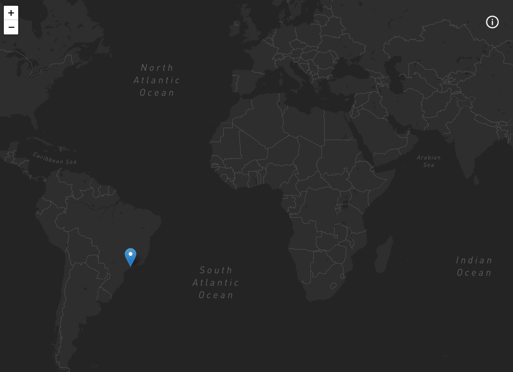

<h1 align="center">
  :airplane:
   
  My Trips
</h1>

<h3 align="center">
<strong>Project based on <a href="https://www.udemy.com/course/aprenda-nextjs-na-pratica/" target="_blank">Udemy Course: NextJS na prática </a></strong>
</h3>

  
  
  
  
   
   
  <a href="#space_invader-technologies">Technologies</a>
   
   
  
   
   
  <a href="https://rs-mytrips.vercel.app/" target="_blank">visit</a>

## :space_invader: Technologies

- [NextJS](https://nextjs.org/)
- Typescript
- [Styled components](https://styled-components.com/)
- [Styled Icons](https://styled-icons.js.org/)
- GraphQL
- [GraphQL code generator](https://www.graphql-code-generator.com/)
- [graphql-request](https://github.com/prisma-labs/graphql-request)
- [Jest](https://jestjs.io/)
- [React Leaflet](https://react-leaflet.js.org/)
- Eslint
- Prettier
- Editorconfig
- Husky
- Mapbox
- [nextjs-progressbar](https://github.com/apal21/nextjs-progressbar)
- [Next SEO](https://github.com/garmeeh/next-seo)
